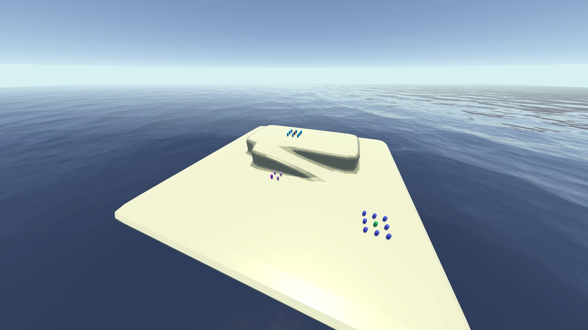

# Bad North


---

## Overview
**Bad North** is a Unity-based sandbox project designed to experiment with **troop movement mechanics**  
in a handcrafted map. This project serves as an introductory Unity experiment and was one of my first Unity projects.

Another Unity project explores **Bad North procedural map generation**.



---

## How to Run the Project

### **Clone the Repository**
```sh
git clone https://github.com/mathieu-portfolio/Bad-North.git
```

### **Open in Unity**
- Open **Unity Hub**.
- Click **"Add Project"** and select the folder.
- Open the project in **Unity Editor**.

### **Play the Game**
You can play the release version in `Executable/Bad North.exe`
